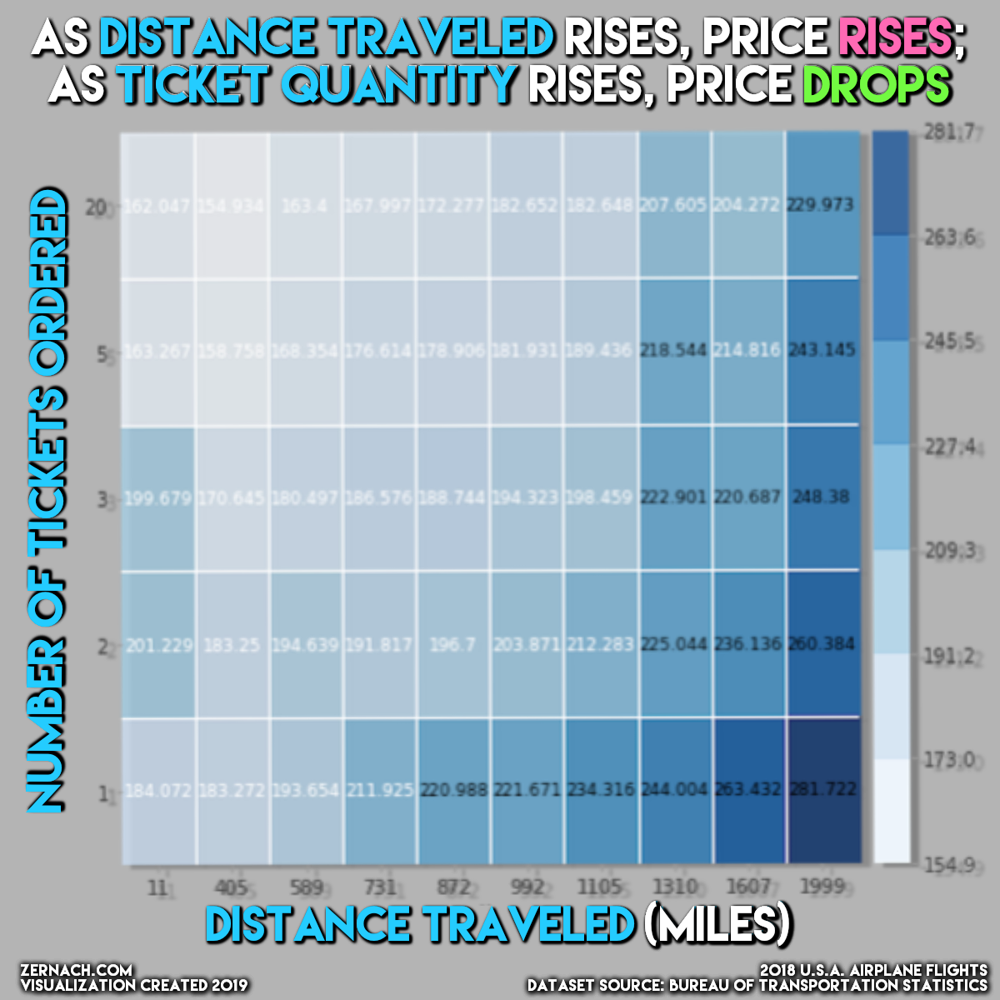

# 🛩 Airline Price Predictions

*****
*****

## SUMMARY

Select your origin city, your destination city, with which airline company you are flying, and how many tickets you are purchasing — and my machine learning model will predict the round-trip cost — based on 9 million 2018 Domestic Flight Prices in the United States. Visit [the live web app](https://airline-price-predictions.herokuapp.com/), deployed on Heroku.

* Here's my [.ipynb notebook file](https://colab.research.google.com/drive/1s3SJs2dpnH2LQvR9S3JNH2C-yD1na_4R?usp=sharing), where I analyzed the data & modeled my prediction algorithm.
* After cleaning the data, I [uploaded the dataset](https://www.kaggle.com/zernach/2018-airplane-flights) to Kaggle for others to use, which has since been downloaded 1,500+ times by others in the Kaggle community!
* Optionally view this project on my [portfolio site](https://ryan.zernach.com/portfolio/airline-price-predictor-how-are-flight-prices-calculated/) or keep scrolling...

*****
*****

## TABLE OF CONTENTS

📚 — [Dependencies](https://github.com/Zernach/Airline-Price-Predictions#-dependencies)

💻 — [How to Locally Run this Repo](https://github.com/Zernach/Airline-Price-Predictions#-how-to-locally-run-this-repo)

🗂 — [Files in This Repo](https://github.com/Zernach/Airline-Price-Predictions#-files-in-this-repo)

📊 — [Modeling Process & Statistical Analysis](https://github.com/Zernach/Airline-Price-Predictions#-modeling-process--statistical-analysis)

0️⃣ — [Data Refining & Cleaning](https://github.com/Zernach/Airline-Price-Predictions#0%EF%B8%8F%E2%83%A3--data-refining--cleaning)

1️⃣ — [Data Distribution Exploration](https://github.com/Zernach/Airline-Price-Predictions#1%EF%B8%8F%E2%83%A3--data-distribution-exploration)

2️⃣ — [Predictive Modeling](https://github.com/Zernach/Airline-Price-Predictions#2%EF%B8%8F%E2%83%A3--predictive-modeling)

3️⃣ — [Feature & Permutation Importances](https://github.com/Zernach/Airline-Price-Predictions#3%EF%B8%8F%E2%83%A3--feature--permutation-importances)

4️⃣ — [Partial Dependence Plots](https://github.com/Zernach/Airline-Price-Predictions#4%EF%B8%8F%E2%83%A3--partial-dependence-plots)

5️⃣ — [Individual Instance Shapley Visualizations](https://github.com/Zernach/Airline-Price-Predictions#5%EF%B8%8F%E2%83%A3--individual-instance-shapley-visualizations)

*****
*****

## 📚 Dependencies
To auto-install the dependencies for this project in a subshell virtual environment, the only packages you'll have to have pre-installed are `python`, `pip`, and `pipenv`.

## 💻 How to Locally Run this Repo
1. Download repo to local machine and `cd` into directory
2. Run `pipenv install` in terminal to install the contents from [Pipfile](https://github.com/Zernach/Airline-Price-Predictions/blob/master/Pipfile) into a virtual environment on your machine — this command will create a Pipfile.lock file of your own
3. Run `pipenv shell` to launch the virtual environment that you just created
4. Run `python run.py` to serve the web-app and host it on a local server on your machine — you'll probably get some warnings about unpickle-ing the machine learning estimator pipeline, but please disregard & open the server @ http://127.0.0.1:8050/ (instead of 8050, your computer might run it on a different port number) on which your computer is now serving the web-app.

## 🗂 Files in This Repo
File/Directory | Description
--- | ---
`📂 Assets` | `📂 Directory` — Includes the .joblib file and all of the individual images that are displayed in the web app. The .joblib file is the trained and compressed machine learning algorithm that's used to generate pricing predictions.
`📂 Pages` | `📂 Directory` — Contains files with the code that's rendered when the user visits different pages on the web app: front page (index.py), live predictions (predictions.py), and modeling process (process.py).
`Pipfile` & `Pipfile.lock` | For more information, please see above section, "How to Locally Run this Repo."
`Procfile` | Declares the web app's server. [Gunicorn](https://gunicorn.org/) is a pure-Python HTTP server for WSGI applications. It allows you to run any Python application concurrently by running multiple Python processes within a single dyno. It provides a perfect balance of performance, flexibility, and configuration simplicity when deploying a web app to somewhere such as [Heroku](https://devcenter.heroku.com/articles/procfile).
`app.py` | Downloads an external stylesheet (.css) theme for quickly launching an interactive web app.
`run.py` | This is main, executable HTML server file, except I wrote it in Python using [Dash](https://dash.plotly.com/introduction).

*****
*****

## Questions?
I can be reached via email: [Ryan@Zernach.com](mailto:Ryan@Zernach.com)

*****
*****

## 📊 MODELING PROCESS & STATISTICAL ANALYSIS

### 0️⃣ — DATA REFINING & CLEANING

To predict airline flight prices, I downloaded data from a database that was produced by the U.S. Bureau of Transportation Statistics. Although there weren't any NaN values in any of the datasets, there were unnecessary/excess columns for my purposes, so after a few hours of [wrangling the data](https://colab.research.google.com/drive/1TjZ19xNmPREin1wmech0sSbGs_OeXWxA), I was able to slim it down from (27M rows X 42 columns) to (9M rows X 12 columns). After getting the dataset in a position where it was most usable for predicting flight prices, I [uploaded it to Kaggle](https://www.kaggle.com/zernach/2018-airplane-flights) for others to use — over 500 people have downloaded it thus far. 🙂

### 1️⃣ — DATA DISTRIBUTION EXPLORATION

To get a feel for the distribution of data, I used Seaborn library's distplot( ) function on a handful of features: 

* ✅ Airline Company: there are (12) airline companies in this dataset, but the top (5) most common airline companies in this dataset are Southwest Airlines Co., Delta Air Lines Inc., American Airlines Inc., United Air Lines Inc., and JetBlue Airways

* ✅ Miles Traveled: it appears that the most common miles traveled value for this dataset is ~1,000. The vast majority of values fall under 2,800 miles, but there are some outliers in the 3,000-5,000+ miles traveled range.

*  ✅ Price per Ticket: the median price per ticket in this dataset is ~$180, but the average is a bit higher at ~$232 due to the rightward skew of this feature

*  ✅ Number of Tickets Ordered: most people only ordered one ticket, and the more tickets that were ordered, the fewer instances that occurred

### 2️⃣ — PREDICTIVE MODELING

To be able to test my model without bias, I used sklearn's train_test_split( ) function twice, which gave me three random samples of the 9M+ instances of data: 35-percent for the training set, 35-percent for the validation set, and 30-percent for the testing set.

For my target variable, I selected PricePerTicket in order to create an artificial ticket ordering web app. PricePerTicket is a continuous variable — therefore, the predictive models that I used were all regression models (as opposed to classification models).

All of the other columns within this dataset are my features that I used for creating a predictive model. I was certain to ensure that none of the other features are "leaking" into the results of the price prediction. In other words, I ensured that none of the variables allowed the model to "time travel". All of the features that contribute to PricePerTicket are variables that can be known before buying a ticket, as opposed to variables known after buying a ticket, which would be data leakage.

After numerically encoding the dataset's categorical features by trying both an Ordinal Encoder and a Target Encoder, I tried several different predictive models: Linear Regressor, Ridge Regressor, and Random Forest Regressor.

For evaluating my models' accuracy, I used the R² Error scoring metric. Every combination of encoders and models beat the mean baseline of zero R² Error, but the one that scored the highest of all of them was pairing an Ordinal Encoder with a Random Forest Regressor model (R² Error = 0.32). The Ridge & Linear Regressors both scored about ~0.175, indicating that they are roughly half as accurate than the Random Forest Regressor for this dataset.

### 3️⃣ — FEATURE & PERMUTATION IMPORTANCES

To understand which features of this dataset have the most influence on the price per ticket, I pulled the feature importances characteristic from my fitted Random Forest Regression model and plotted them on a graph:

### 4️⃣ — PARTIAL DEPENDENCE PLOTS

Partial Dependence Plots (PDPs) show how a feature approximately affects the target variable when that feature is adjusted:

### 5️⃣ — INDIVIDUAL INSTANCE SHAPLEY VISUALIZATIONS

In my programming notebook, I created a Shapley Force Plots to explain the outcomes of individual instances. Oftentimes, when using decision tree models (in my case, a Random Forest Regressor), it can be difficult to understand how and why the model predicted that specific output without the help of a special library, such as Shapley. I included two examples of Shapley Force Plots below, which have been paired with their respective row from the dataset:

